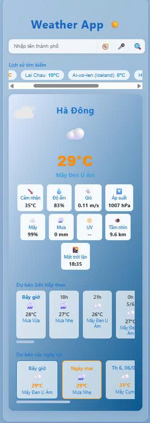

# 🌦️ Weather App - Ứng dụng Dự báo Thời tiết Hiện đại

---

## 👀 Preview

<p align="center">
  
</p>

---

## 🚀 Giới thiệu

**Weather App** là ứng dụng web dự báo thời tiết trực quan, sinh động, sử dụng ReactJS, Axios và hiệu ứng động Lottie. Ứng dụng hỗ trợ tìm kiếm thời tiết theo thành phố, dự báo theo giờ/ngày, lưu lịch sử, hiệu ứng nền động theo điều kiện thời tiết, giao diện hiện đại và responsive trên mọi thiết bị.

---

## 🎯 Tính năng nổi bật

- 🔍 **Tìm kiếm thời tiết** theo tên thành phố (hỗ trợ tiếng Việt).
- 📍 **Lấy vị trí hiện tại** bằng GPS để xem nhanh thời tiết nơi bạn đang đứng.
- 🎤 **Tìm kiếm bằng giọng nói** (Speech Recognition, Chrome).
- 📊 **Hiển thị chi tiết**: nhiệt độ, cảm nhận, độ ẩm, gió, áp suất, mây, mưa, UV, tầm nhìn, giờ mặt trời lặn.
- 🕒 **Dự báo 24h tiếp theo** và **dự báo 5 ngày tới**.
- 🕑 **Lưu lịch sử tìm kiếm** (localStorage), truy cập nhanh các thành phố đã xem.
- 🎬 **Hiệu ứng động Lottie**: nền động theo thời tiết (nắng, mưa, mây, sấm chớp, tuyết, sương mù...).
- 🎨 **Gradient nền động, mịn** và tự động đổi màu theo điều kiện thời tiết.
- 📱 **Responsive**: giao diện tối ưu cho PC, laptop, tablet, điện thoại.
- 💎 **Thiết kế UI hiện đại**: bo góc, bóng đổ, màu sắc hài hòa, thanh cuộn đẹp.

---

## 🏗️ Cấu trúc thư mục

```
src/
├── components/
│   ├── WeatherCard.js           # Card hiển thị thông tin thời tiết
│   └── WeatherBackground.jsx    # Hiệu ứng nền động Lottie
├── hooks/
│   └── useUVI.js                # Hook lấy chỉ số UV
├── utils/
│   └── getWeatherIcon.js        # Hàm trả về icon thời tiết
├── assets/
│   └── lottie/                  # Các file animation .json
│       └── ...
├── App.js                       # Thành phần chính
├── App.css                      # Style tổng thể
├── index.js
└── index.css
```

---

## ⚡️ Hướng dẫn sử dụng

### 1. Cài đặt

```bash
git clone https://github.com/yourusername/weatherapp2.git
cd weatherapp2
npm install
```

### 2. Chạy ứng dụng

```bash
npm start
```

- Ứng dụng chạy tại: [http://localhost:3000](http://localhost:3000)

### 3. Tùy chỉnh API Key

- Mặc định đã có API Key mẫu cho OpenWeatherMap.
- Để dùng API Key riêng, sửa biến `API_KEY` trong:
  - `src/App.js`
  - `src/hooks/useUVI.js`

### 4. Thêm hiệu ứng động mới

- Thêm file animation `.json` vào `src/assets/lottie/`.
- Map tên animation vào `WeatherBackground.jsx` và `WeatherCard.js` nếu muốn dùng cho nền hoặc icon động.

### 5. Responsive

- Giao diện tự động co giãn phù hợp mọi màn hình.
- Có thể chỉnh sửa thêm trong `App.css` nếu muốn cá nhân hóa giao diện.

---

## 📝 Ví dụ sử dụng

- **Tìm kiếm thành phố:** Nhập tên thành phố (ví dụ: `Hà Nội`, `London`, `Tokyo`) và nhấn 🔍.
- **Lấy vị trí hiện tại:** Nhấn 🧭 để lấy nhanh thời tiết nơi bạn đang đứng.
- **Tìm kiếm bằng giọng nói:** Nhấn 🎤 và nói tên thành phố.
- **Xem dự báo:** Xem dự báo 24h tiếp theo và 5 ngày tới ngay trên giao diện.
- **Lịch sử:** Nhấn vào tên thành phố trong lịch sử để xem lại nhanh.

---

## 🛠️ Công nghệ sử dụng

- [ReactJS](https://reactjs.org/) (Hooks)
- [Axios](https://axios-http.com/) (gọi API)
- [Lottie-react](https://github.com/Gamote/lottie-react) (hiệu ứng động)
- CSS3 (responsive, gradient, animation)
- [OpenWeatherMap API](https://openweathermap.org/api)

---

## 🤝 Đóng góp & phát triển

1. **Fork** repo, tạo branch mới.
2. **Commit** thay đổi, gửi pull request.
3. Đóng góp thêm hiệu ứng, tối ưu UI/UX, bổ sung tính năng mới.

---

## 📄 Bản quyền & Ghi chú

- Ứng dụng sử dụng dữ liệu từ [OpenWeatherMap](https://openweathermap.org/).
- Các hiệu ứng động Lottie thuộc bản quyền tác giả gốc trên [LottieFiles](https://lottiefiles.com/).
- Bạn có thể sử dụng, chỉnh sửa, phát triển lại cho mục đích cá nhân hoặc học tập.

---
